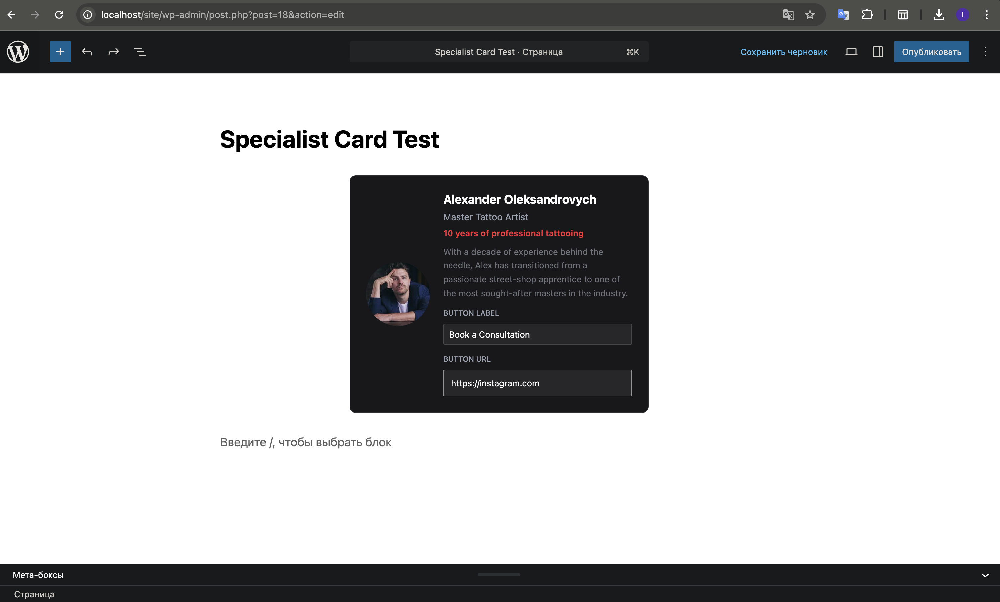
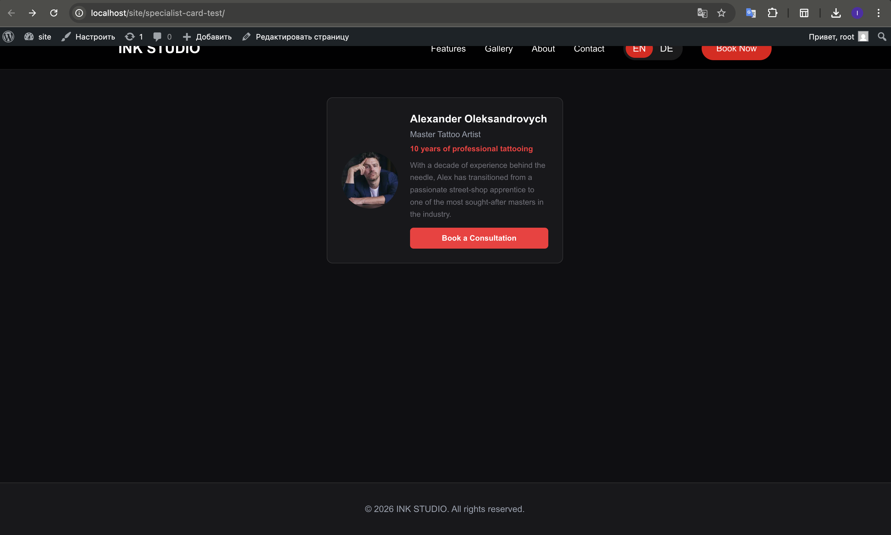

# ArtonSkin — WordPress Theme

Custom WordPress theme for a tattoo studio landing page. Built with SCSS, BEM, vanilla JS and WordPress REST API.

---

## Requirements

- PHP 8.0+
- WordPress 6.0+
- Node.js 18+ and npm
- Local server: MAMP / XAMPP / LocalWP

---

## Local Setup

### 1. Clone the repository

```bash
git clone https://github.com/Ihor7213/skin-wp-theme.git
```

Place the cloned folder inside your WordPress themes directory:

```
/wp-content/themes/site-tattoo/
```

### 2. Install dependencies

```bash
cd site-tattoo
npm install
```

### 3. Build CSS

```bash
npm run build:css
```

To watch for changes during development:

```bash
npm run watch:css
```

### 4. Activate the theme

Go to **WordPress Admin → Appearance → Themes** → activate **ArtonSkin**.

### 5. Enable pretty permalinks

Go to **Settings → Permalinks** → select **Post name** → Save Changes.  
Required for the REST API to work correctly.

---

## Theme Structure

```
site-tattoo/
├── assets/
│   ├── css/            # Compiled CSS (generated, do not edit)
│   ├── images/         # Static images
│   ├── js/
│   │   └── main.js     # Burger menu, i18n (EN/DE), form validation, Fetch API
│   └── scss/
│       ├── style.scss  # Main entry point
│       └── _*.scss     # Section partials
├── blocks/
│   └── specialist-card/
│       ├── block.json        # Block metadata and attributes
│       ├── index.js          # Edit and Save components
│       ├── index.asset.php   # Script dependencies
│       └── style.css         # Block styles
├── template-parts/
│   └── sections/
│       ├── hero.php
│       ├── features.php
│       ├── gallery.php
│       ├── about.php
│       ├── process.php
│       ├── artists.php
│       ├── reviews.php
│       ├── faq.php
│       └── contact.php
├── front-page.php    # Assembles all sections
├── header.php
├── footer.php
├── functions.php     # Enqueue assets, CPT, REST API, Gutenberg block
├── index.php
├── style.css         # Theme header (required by WordPress)
└── package.json
```

---

## Features

### Task 1 — Theme Setup
- Custom WordPress theme (no parent)
- SCSS compiled via `npm run build:css` / `npm run watch:css`
- BEM naming convention
- Mobile-first responsive layout (375 / 768 / 1280 px)
- Cross-browser: Chrome, Firefox, Safari (last 2 versions)

### Task 2 — Landing Page Sections
- **Hero** — title, subtitle, two CTA buttons
- **Features** — 6 service cards (CSS Grid)
- **Gallery** — photo grid
- **About** — studio info
- **Process** — step-by-step workflow
- **Artists** — team cards
- **Reviews** — async loaded from REST API with skeleton loader
- **FAQ** — accordion
- **Contact** — address, phone, email, hours
- **Booking form** — JS validation + Fetch submission to custom REST endpoint
- **i18n** — English / German language switch

### Task 3 — Gutenberg Block "Specialist Card"
Custom block registered at `blocks/specialist-card/`.

**Attributes:** `name`, `role`, `years`, `bio`, `ctaText`, `ctaUrl`, `photoUrl`, `photoAlt`

**Usage:** WordPress Admin → any page → Block inserter → search "Specialist Card"

#### Screenshots

**Editor view:**


**Frontend view:**


### Task 4 — Testimonials REST API
- Custom Post Type `testimonials` registered with `show_in_rest: true`
- Custom REST fields: `rating`, `author_name`, `position`
- Async fetch with skeleton loader and error handling
- Endpoint: `GET /wp-json/wp/v2/testimonials`

---

## REST API Endpoints

| Method | Endpoint | Description |
|--------|----------|-------------|
| `POST` | `/wp-json/artonskin/v1/booking` | Submit booking form |
| `GET`  | `/wp-json/wp/v2/testimonials`   | Get all testimonials |

---

## Git Commit History

```
fix:  add index.asset.php for Specialist Card block dependencies
feat: register Specialist Card Gutenberg block
feat: async testimonials fetch with skeleton loader and error handling
feat: register testimonials CPT and expose via REST API
feat: add JS with i18n, burger menu, form validation and Fetch submission
feat: enqueue theme styles and scripts in functions.php
feat: add front-page.php and assemble all sections
feat: add process, artists, reviews, faq and contact sections
feat: add hero, features, gallery and about sections
feat: add header.php and footer.php templates
feat: add SCSS sources and npm build setup
init: scaffold WordPress theme with style.css header
```
